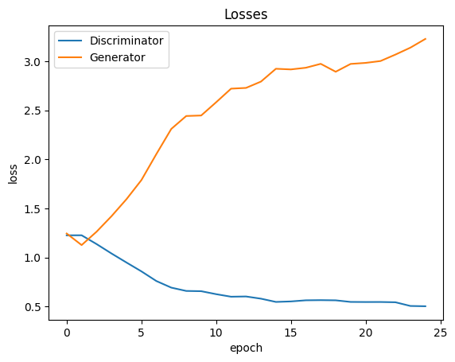

# Conditional-DCGAN

Training a Conditional Deep Convolutional Generative Adversarial Network on the Fashion MNIST dataset. I have used embedding layers to encode the labels and pass it into the Discriminator and Generators.

# Training Results

The model isn't performing well. The loss curves of the network show that the Discriminator converges with idea value but the Generator fails to converge. This means that the Discriminator network is too strong compared to the generator. Will try to fix this and update the training loss.
